

<h1 align="center">Cairn</h1>

**Cairn** is a fork of the [MeshCore](https://github.com/meshcore-dev/MeshCore) companion firmware. Every board is built from one source tree that shares MeshCore's mesh and radio code, and every build works with the official MeshCore apps ([web](https://app.meshcore.nz), [Android](https://play.google.com/store/apps/details?id=com.liamcottle.meshcore.android), [iOS](https://apps.apple.com/us/app/meshcore/id6742354151)).

Builds are numbered. The splash screen shows **BUILD N**, releases are tagged `cairn-vN`, and the files are named `MeshCore-<Board>-CairnN-<date>…`, so you can match a device to a release from its own screen. **Download the files from the [latest release](https://github.com/cvhviz/Cairn/releases/latest).** Cairn 108 is a T-Display SF32-only update: every other board's files are in [Cairn 107](https://github.com/cvhviz/Cairn/releases/tag/cairn-v107). L1 releases from before Cairn are in the [older L1 repository](https://github.com/cvhviz/WioL1Pro-CVHBuild).

## Supported boards

✅ **Tested**: used on real hardware before each release. ✅ **Beta**: tested on hardware, but new to Cairn, so some of its features haven't been tried on the board yet (its page lists them). 🧪 **Preview**: builds from the same tree but hasn't been tried on hardware yet. Reports are welcome.

### nRF52840 (install by copying a `.uf2`)

| Board | Interface | Status | Install | Board page |
|---|---|---|---|---|
| Seeed Wio Tracker L1 Pro | OLED (SH1106 or 2.42" SSD1309 "DV1") or e-ink; joystick | ✅ | [UF2](docs/install/nrf52-uf2.md) | [L1 Pro](docs/boards/wio-tracker-l1-pro.md) |
| Heltec Mesh Node T096 | 0.96" TFT, one button, themes | ✅ | [UF2](docs/install/nrf52-uf2.md) | [T096](docs/boards/heltec-t096.md) |
| RAK4631, RAK3401, ProMicro, Nano G2 Ultra, Heltec T1, GAT562 boards, Meshtiny, Keepteen LT1, LilyGO T-Impulse Plus | OLED or colour TFT (Heltec T1, with themes), one-button UI | 🧪 | [UF2](docs/install/nrf52-uf2.md) | [Preview boards](docs/boards/preview-boards.md) |

### ESP32 / ESP32-S3 (install with esptool or a web flasher)

| Board | Interface | Status | Install | Board page |
|---|---|---|---|---|
| Seeed Wio Tracker L2 Pro | 3.2" touchscreen | ✅ | [esptool / web](docs/install/esp32-s3.md) | [L2 Pro](docs/boards/wio-tracker-l2-pro.md) |
| Heltec WiFi LoRa 32 V4 + Expansion Kit (2.8" touch) | touchscreen, the same UI as the L2 | ✅ | [esptool / web](docs/install/esp32-s3.md) | [Heltec V4 touch](docs/boards/heltec-v4-touch.md) |
| Elecrow ThinkNode M9 | 2.4" screen, QWERTY keyboard and d-pad (no touch): the L2's interface, driven by keys | ✅ beta | [esptool / web](docs/install/esp32-s3.md) | [ThinkNode M9](docs/boards/thinknode-m9.md) |
| ESP32-S3: Heltec V4 / V4-R8 / V3 (OLED), Heltec Wireless Tracker (V1, V2), LilyGO T-Beam Supreme and T-Beam 1W, T3S3, Station G2 / G3 (USB build only), XIAO ESP32-S3, ThinkNode M2, Meshnology W12, Ebyte EoRa-S3. Original ESP32: Heltec V2, LilyGO T-Beam (SX1262 / SX1276, Bluetooth build only), T-LoRa V2.1-1.6, MeshAdventurer | OLED or colour TFT (Wireless Tracker, with themes), one-button UI | 🧪 | [esptool / web](docs/install/esp32-s3.md) | [Preview boards](docs/boards/preview-boards.md) |

The boards listed under "Original ESP32" use the original ESP32 rather than the S3. They install the same way; the [ESP32 guide](docs/install/esp32-s3.md#original-esp32-boards) has the one difference.

### SiFli SF32 (install with one double-click)

| Board | Interface | Status | Install | Board page |
|---|---|---|---|---|
| LilyGO T-Display SF32 + keypad board | 480×480 AMOLED touchscreen, 20-key keypad, its own card-based interface | ✅ | [installer for Mac, Windows, Linux](docs/install/sf32.md) | [T-Display SF32](docs/boards/lilygo-t-display-sf32.md) |

**Cairn 108 (7 Oct 2026) is a T-Display SF32 update:** Wi-Fi updates no longer roll back on their first start, and the board no longer logs a bus error every second while the keyboard is detached. On Cairn 107, update over Wi-Fi with the keyboard board attached: **Settings › System › Firmware update**. If your board has the first SF32 build (6 Oct), use the [USB installer](docs/install/sf32.md#if-your-board-has-the-first-sf32-build).

### Coming soon

| Board | Interface | Notes |
|---|---|---|
| LilyGO T-Deck | keyboard + trackball, touchscreen | A T-Deck Plus port is in progress. |

**Also coming:** map downloads straight to the device over Wi-Fi, so you won't need a computer to prepare the offline map card. Until then, [tools/l2_maptiles.py](tools/l2_maptiles.py) builds the card on a computer.

Want another board? [Ask for it](https://github.com/cvhviz/Cairn/issues/new?template=board_request.yml).

## Features

| | L1 Pro | L2 Pro | Heltec V4 touch | ThinkNode M9 | T-Display SF32 | T096 | Preview boards |
|---|:-:|:-:|:-:|:-:|:-:|:-:|:-:|
| Works with the official MeshCore apps (Bluetooth) | ✅ | ✅ | ✅ | ✅ | ✅ | ✅ | ✅ |
| USB-serial companion image | | | | | | ✅ | ✅ |
| Touch UI with on-screen keyboard and colour emoji | | ✅ | ✅ | keys (QWERTY + d-pad), colour emoji | touch + keypad | | |
| Wi-Fi: app link, clock sync, browser updates | | ✅ | ✅ | ✅ | clock sync, online updates | | |
| Online updates from this repository | | ✅ | ✅ | from its next build | ✅ | | |
| GPS | ✅ | ✅ | ✅ (Expansion Kit) | ✅ | ✅ | ✅ | if the board has one |
| Offline map from microSD | | ✅ | ✅ | not tried yet | coming | | |
| microSD card | | ✅ | ✅ | ✅ | ✅ | | |
| Spectrum and band scan | | ✅ | ✅ | ✅ | ✅ | spectrum | |
| Repeater scan and remote admin on the device | | ✅ | ✅ | ✅ | ✅ | | |
| Room server image | ✅ | | | | | | |
| Colour themes | | | | | | ✅ | colour-screen boards (Wireless Tracker, T1) |
| Music player, voice recorder, IR remote, climate and step sensors | | | | | ✅ | | |
| Imperial units, 12-hour clock | ✅ | ✅ | ✅ | ✅ | ✅ | ✅ | ✅ |

## Which file do I need?

Each release carries every board's files, named `MeshCore-<Board>-CairnN-<date>[-<variant>].<ext>`. Your board page lists them all.

| You want to… | nRF52840 boards | ESP32 boards | T-Display SF32 |
|---|---|---|---|
| **Install Cairn for the first time** | the board's `.uf2` | the board's `-full.bin` at `0x0`, after a full erase. **This erases everything on the device.** Back up your identity first. | the `-install.zip`: unzip, double-click the installer |
| **Update an existing Cairn device** | the board's `.uf2` (keeps your identity, contacts and settings) | the board's `-update.bin` at `0x10000`, or over Wi-Fi on the L2, Heltec V4 touch and ThinkNode M9 (the M9 from its next build). Keeps everything. | the `-install.zip` again, or over Wi-Fi (the board fetches the `-update.bin`). Keeps everything. |
| **Recover a device that won't boot** | re-copy the `.uf2`; the bootloader is never touched | erase, then the `-full.bin` at `0x0` | reset the board (hold A for 12 s), then run the `-install.zip` installer again |

On ESP32 boards, flash either the `-full.bin` or the `-update.bin`, never both. `SHA256SUMS.txt` in each release covers every file: `shasum -a 256 -c SHA256SUMS.txt`.

Install guides: [nRF52840 (UF2)](docs/install/nrf52-uf2.md) · [ESP32 (esptool or web)](docs/install/esp32-s3.md) · [T-Display SF32 (one-click installer)](docs/install/sf32.md)

## Wio Tracker L2 Pro: brochure, manual and screens

- [Cairn brochure (PDF)](docs/Cairn_Wio_L2_Pro_Brochure.pdf): the firmware, the board and the 3D-printed case, in nine pages.
- [Cairn user manual (PDF)](docs/Cairn_Wio_L2_Pro_User_Manual.pdf): every screen and setting, explained step by step. The offline-map tool it mentions is [tools/l2_maptiles.py](tools/l2_maptiles.py) ([how to use it](tools/L2_MAPTILES.md)).
- The touch features are listed on the [L2 Pro board page](docs/boards/wio-tracker-l2-pro.md). The Heltec V4 touch build runs the same interface.

More promo images (free to share) are in [docs/promo](docs/promo).

### Screens

| | | |
|---|---|---|
| 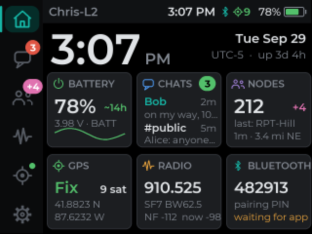 Home | 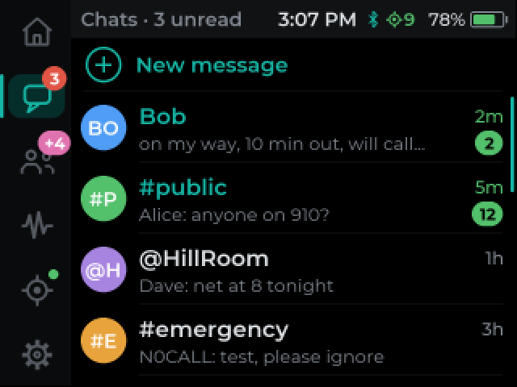 Chats | 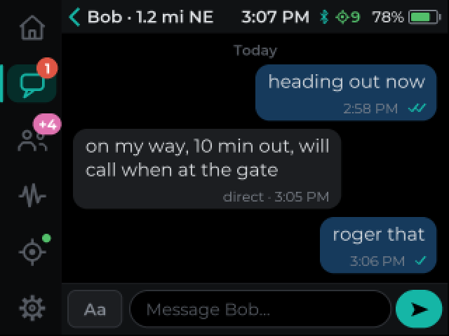 Conversation |
| 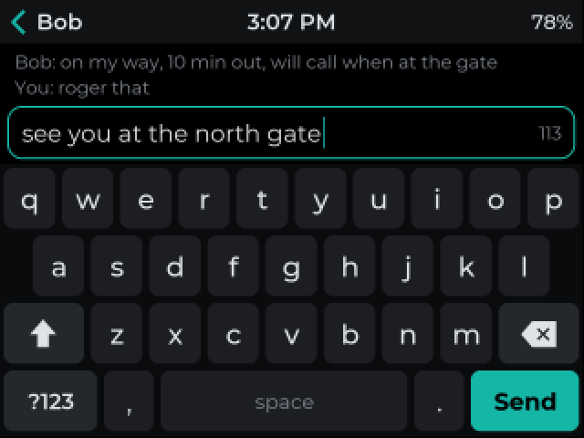 Keyboard | 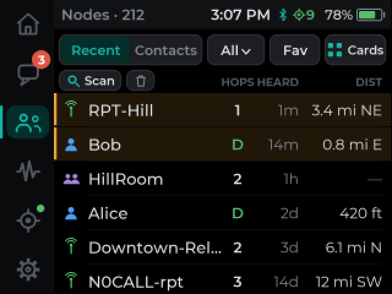 Nodes | 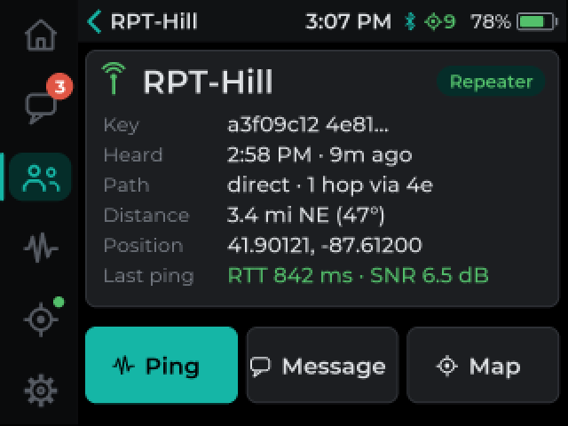 Node detail |
| 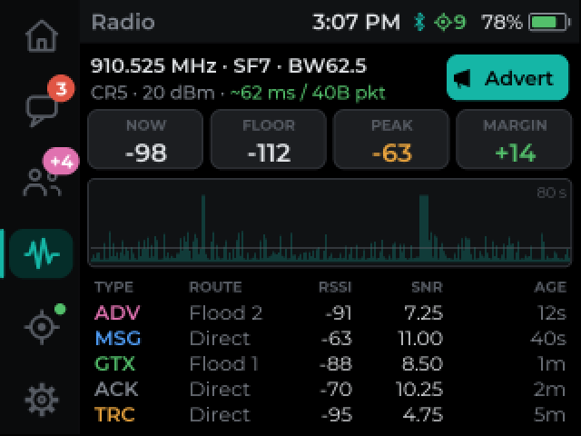 Radio | 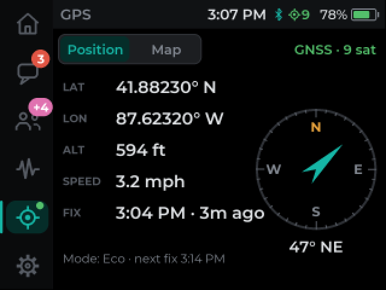 GPS | 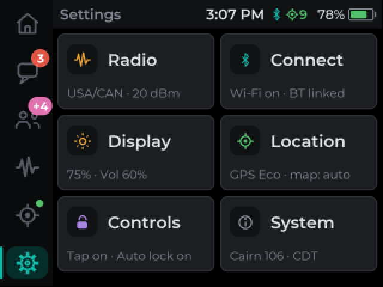 Settings |
| 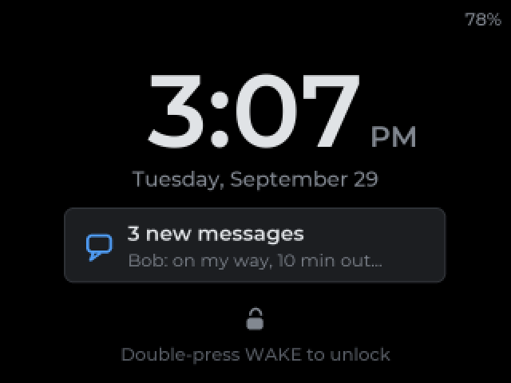 Lock screen | 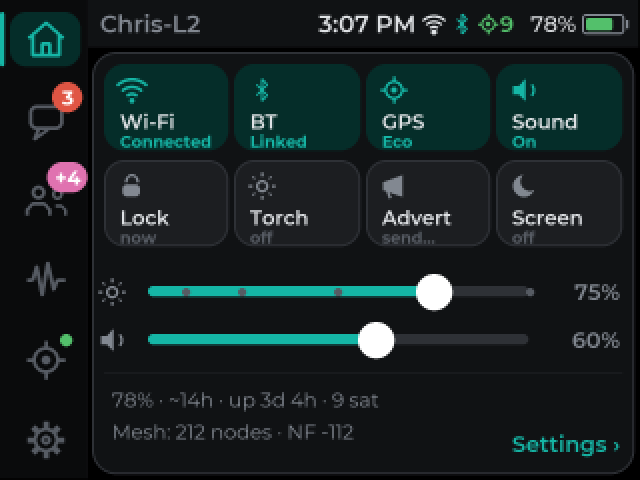 Quick panel | 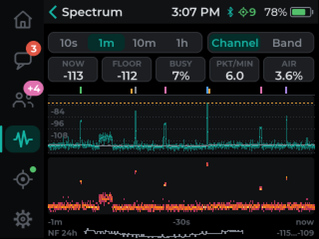 Spectrum |
| 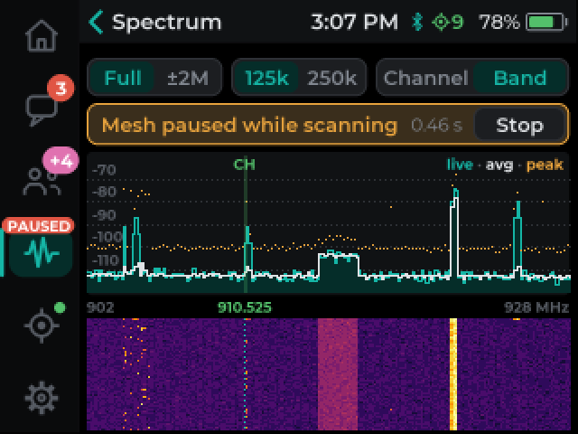 Band scan | 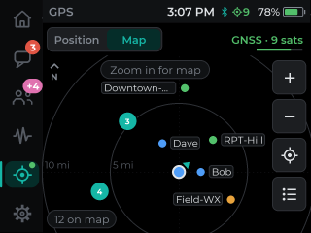 Map | 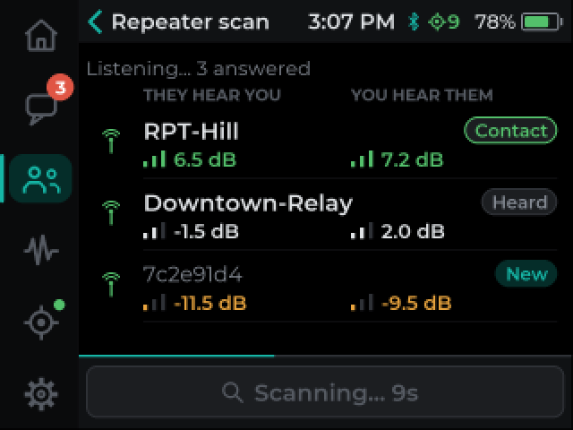 Repeater scan |
| 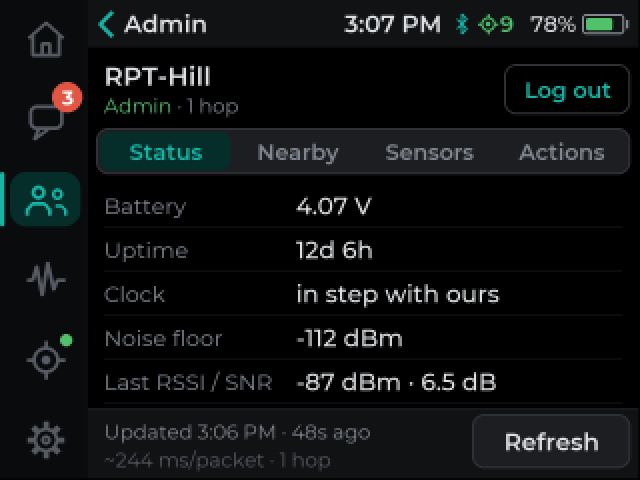 Repeater admin | 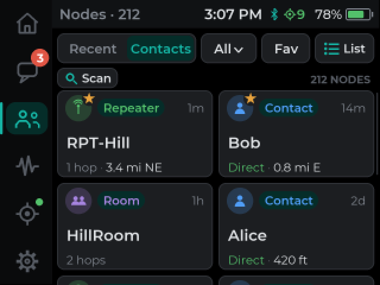 Nodes as cards | 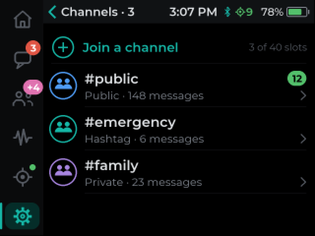 Channels |
| 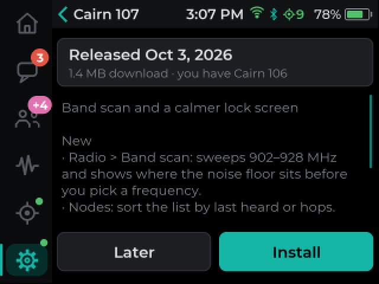 Firmware update | | |

Screens use fictional sample data.

## Reporting a problem

[Open an issue](https://github.com/cvhviz/Cairn/issues/new/choose) and pick **Bug report**. The form asks for the board, the build number from the splash screen, how you installed it, and what happened. A serial log helps a lot. Reports on 🧪 preview boards are especially useful, including "it works".

## Publishing a release (for the online updater)

The L2, Heltec V4 touch, ThinkNode M9 and T-Display SF32 builds read `https://api.github.com/repos/cvhviz/Cairn/releases/latest`. For a build to be offered:

- Tag it `cairn-vN`, where N is the build number shown on the splash (it must be higher than the device's own). Publish it as a normal release, not a draft or prerelease.
- Attach each of these boards' `-update.bin` under its exact name, `MeshCore-WioL2Pro-CairnN-YYYY-MM-DD-update.bin`, `MeshCore-HeltecV4Touch-CairnN-YYYY-MM-DD-update.bin`, `MeshCore-ThinkNodeM9-CairnN-YYYY-MM-DD-update.bin` and `MeshCore-TDisplaySF32-CairnN-YYYY-MM-DD-update.bin` (the SF32 also accepts a `<asset>.sha256` next to it): nothing between the date and `-update.bin`. GitHub records each file's SHA-256, which the device checks, along with the size and the board's OTA marker inside the image.
- No other asset may start with `MeshCore-WioL2Pro-Cairn`, `MeshCore-HeltecV4Touch-Cairn`, `MeshCore-ThinkNodeM9-Cairn` or `MeshCore-TDisplaySF32-Cairn` and end in `-update.bin`. Preview boards use their own board names.
- The release notes are shown on the device before installing, so keep the top of them short and plain.

## Relationship to upstream

This is a personal build, not a general-purpose distribution. All core mesh and radio behaviour comes from [MeshCore](https://github.com/meshcore-dev/MeshCore). See that project for protocol documentation, the official flasher, its own list of supported hardware and the client apps. Cairn tracks MeshCore releases; the release notes say which version each build is based on. Credit to the MeshCore developers and community for the foundation.

## License

MIT, same as upstream MeshCore. The firmware embeds third-party fonts, emoji and libraries under their own licences; see [THIRD_PARTY_NOTICES.md](THIRD_PARTY_NOTICES.md) and [licenses/](licenses/).
