

  <picture>
    <source media="(prefers-color-scheme: dark)" srcset="docs/logo/cairn-lockup-stacked.png">
    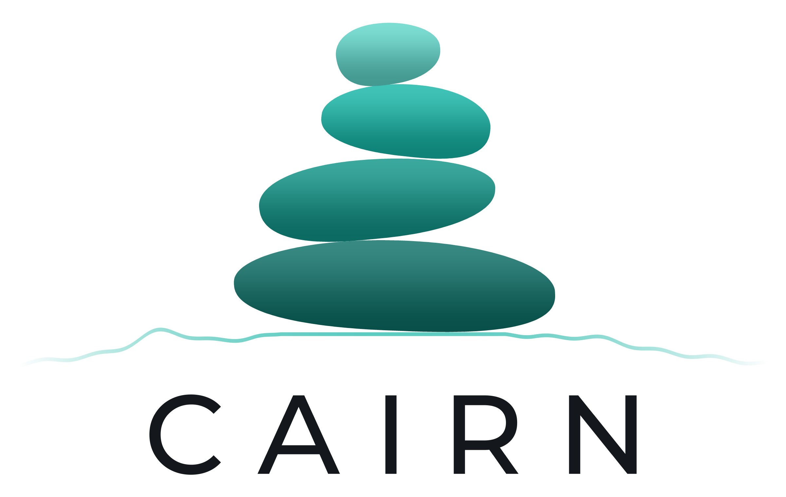
  </picture>

**Cairn** is a fork of the [MeshCore](https://github.com/meshcore-dev/MeshCore) companion firmware. Every board is built from one source tree that shares MeshCore's mesh and radio code, and every build works with the official MeshCore apps ([web](https://app.meshcore.nz), [Android](https://play.google.com/store/apps/details?id=com.liamcottle.meshcore.android), [iOS](https://apps.apple.com/us/app/meshcore/id6742354151)).

Builds are numbered: the splash screen shows **BUILD N**, releases are tagged `cairn-vN`, and files are named `MeshCore-<Board>-CairnN-<date>…`, so you can match a device to a release from its own screen.

**Download the files from the [latest release](https://github.com/cvhviz/Cairn/releases/latest).** L1 releases from before Cairn are in the [older L1 repository](https://github.com/cvhviz/WioL1Pro-CVHBuild).

## Latest: Cairn 112 (9 Oct 2026)

- **Settings as tiles:** every Settings page now uses tiles like the Settings root: two across, each with an icon, its name and its value. A tap flips a switch on its tile; other values open a small sheet.
- **Screensaver** (Settings › Appearance › Screensaver): Beacon, Ambient, Night clock or Auto, for a screen set never to time out.
- **Notices in the status bar:** a new message or a saved setting tints the status bar for a moment instead of covering the page. When a notice leads somewhere, a tap on it opens it.
- **Updater mode** (was "update mode"): send an update over Wi-Fi from a browser; with the next CairnOS update, the app can start one over Bluetooth once you tap Allow on the board.
- **Sent messages sync:** messages sent from a phone app appear in the board's chats, and messages sent on the board appear in CairnOS.
- **Quick panel:** Radio · Theme · Settings buttons along the bottom.
- **M9 and T-Deck:** the keys reach each card in the Nodes Cards view, and the keyboard light goes dark sooner on battery. The T-Deck's Battery saver roughly doubles screen-off standby (about 54 h instead of 28 h).
- **T-Display SF32** (from 108): a mini spectrum in the Home header, Settings as cards, the nine themes, larger text and colour emoji, sent-message sync, Wake on motion, and a power switch that turns the docked board off on battery. See its [board page](docs/boards/lilygo-t-display-sf32.md).
- **Updating:** L2 Pro, Heltec V4 touch, ThinkNode M9, T-Deck and T-Display SF32 update over Wi-Fi in **Settings › System › Firmware update**. The T096 companion and the compact repeaters are rebuilt as Cairn 112 with no functional changes.
- **Other boards:** the L1 Pro and the preview boards stay on [Cairn 107](https://github.com/cvhviz/Cairn/releases/tag/cairn-v107).

Cairn 111 added nine themes, a QR code for sharing contacts, GPS data and the path hash setting; see its [release notes](https://github.com/cvhviz/Cairn/releases/tag/cairn-v111).

## Supported boards

✅ **Tested**: used on real hardware before each release. ✅ **Beta**: tested on hardware but new to Cairn; its page lists what hasn't been tried yet. 🧪 **Preview**: builds from the same tree but hasn't been tried on hardware. Reports are welcome.

### nRF52840 (install by copying a `.uf2`)

| Board                                                         | Screen and input               | Status | Install guide                    |
| ------------------------------------------------------------- | ------------------------------ | ------ | -------------------------------- |
| [Seeed Wio Tracker L1 Pro](docs/boards/wio-tracker-l1-pro.md) | OLED or e-ink, joystick        | ✅     | [UF2](docs/install/nrf52-uf2.md) |
| [Heltec Mesh Node T096](docs/boards/heltec-t096.md)           | 0.96" colour TFT, one button   | ✅     | [UF2](docs/install/nrf52-uf2.md) |
| [Preview boards](docs/boards/preview-boards.md)               | OLED or colour TFT, one button | 🧪     | [UF2](docs/install/nrf52-uf2.md) |

The L1 Pro takes the SH1106 OLED, the 2.42" SSD1309 "DV1" OLED or the e-ink display. nRF52840 preview boards: RAK4631, RAK3401, ProMicro, Nano G2 Ultra, Heltec T1, GAT562 boards, Meshtiny, Keepteen LT1, LilyGO T-Impulse Plus.

### ESP32 / ESP32-S3 (install with esptool or a web flasher)

| Board                                                         | Screen and input                      | Status  | Install guide                             |
| ------------------------------------------------------------- | ------------------------------------- | ------- | ----------------------------------------- |
| [Seeed Wio Tracker L2 Pro](docs/boards/wio-tracker-l2-pro.md) | 3.2" touchscreen                      | ✅      | [esptool / web](docs/install/esp32-s3.md) |
| [Heltec V4 + Expansion Kit](docs/boards/heltec-v4-touch.md)   | 2.8" touchscreen                      | ✅      | [esptool / web](docs/install/esp32-s3.md) |
| [Elecrow ThinkNode M9](docs/boards/thinknode-m9.md)           | 2.4" screen, keyboard, d-pad          | ✅ beta | [esptool / web](docs/install/esp32-s3.md) |
| [LilyGO T-Deck / T-Deck Plus](docs/boards/lilygo-t-deck.md)   | 2.8" touchscreen, keyboard, trackball | ✅ beta | [esptool / web](docs/install/esp32-s3.md) |
| [Preview boards](docs/boards/preview-boards.md)               | OLED or colour TFT, one button        | 🧪      | [esptool / web](docs/install/esp32-s3.md) |

The L2 Pro, Heltec V4, ThinkNode M9 and T-Deck run the same Cairn interface; the M9 drives it by keys and the T-Deck by touch or keys.

ESP32 preview boards: Heltec V4 / V4-R8 / V3 (OLED), Heltec Wireless Tracker (V1, V2), LilyGO T-Beam Supreme and T-Beam 1W, T3S3, Station G2 / G3 (USB build only), XIAO ESP32-S3, ThinkNode M2, Meshnology W12, Ebyte EoRa-S3; and on the original ESP32, Heltec V2, LilyGO T-Beam (SX1262 / SX1276, Bluetooth build only), T-LoRa V2.1-1.6 and MeshAdventurer. The original-ESP32 boards install the same way; the [ESP32 guide](docs/install/esp32-s3.md#original-esp32-boards) has the one difference.

### SiFli SF32 (install with one double-click)

| Board                                                         | Screen and input                   | Status | Install guide                     |
| ------------------------------------------------------------- | ---------------------------------- | ------ | --------------------------------- |
| [LilyGO T-Display SF32](docs/boards/lilygo-t-display-sf32.md) | 480×480 AMOLED touchscreen, keypad | ✅     | [installer](docs/install/sf32.md) |

The T-Display SF32 sits on its 20-key keypad board and runs its own card-based interface. The installer runs on Mac, Windows and Linux.

### Repeaters (compact screen)

| Board                                                             | Screen           | Status  | Install guide                             |
| ----------------------------------------------------------------- | ---------------- | ------- | ----------------------------------------- |
| [Heltec Mesh Node T096](docs/boards/compact-repeater.md)          | 0.96" colour TFT | ✅ beta | [UF2](docs/install/nrf52-uf2.md)          |
| [Heltec T114](docs/boards/compact-repeater.md)                    | 1.14" TFT        | 🧪      | [UF2](docs/install/nrf52-uf2.md)          |
| [Heltec V2, V3, V4, V4-R8](docs/boards/compact-repeater.md)       | 0.96" OLED       | 🧪      | [esptool / web](docs/install/esp32-s3.md) |
| [Heltec Wireless Tracker V1, V2](docs/boards/compact-repeater.md) | 0.96" colour TFT | 🧪      | [esptool / web](docs/install/esp32-s3.md) |

The standard MeshCore repeater with a minimal Cairn screen: Status, Spectrum and a few Settings on the one button, and a power save that keeps the screen and TX LED off until a double-click. Holding the button on Status (~3 s, then release) turns it off; a press turns it back on. The screens below are simulated with fictional sample data.

| | | |
|---|---|---|
| 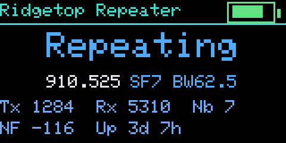 T096 repeater · Status | 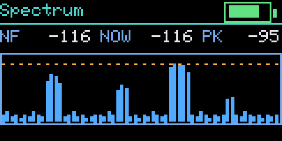 T096 repeater · Spectrum | 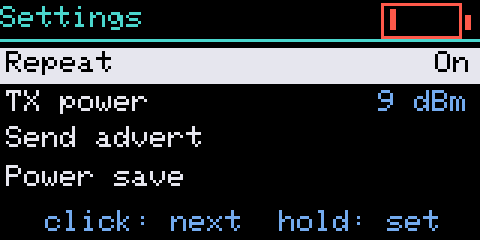 T096 repeater · Settings |

### Coming soon

- **Map downloads on the device**, straight over Wi-Fi, so you won't need a computer to prepare the offline map card. Until then, [tools/maptiles.py](tools/maptiles.py) builds the card on a computer.

Want another board? [Ask for it](https://github.com/cvhviz/Cairn/issues/new?template=board_request.yml).

## Features

| Feature                       |  L1 Pro  | L2 Pro | Heltec V4 touch | ThinkNode M9 |   T-Deck    | T-Display SF32 |   T096   | Preview |
| ----------------------------- | :------: | :----: | :-------------: | :----------: | :---------: | :------------: | :------: | :-----: |
| MeshCore apps over Bluetooth  |    ✅    |   ✅   |       ✅        |      ✅      |     ✅      |       ✅       |    ✅    |   ✅    |
| Input                         | joystick | touch  |      touch      |     keys     | touch, keys | touch, keypad  |  button  | button  |
| Colour emoji                  |    –     |   ✅   |       ✅        |      ✅      |     ✅      |       ✅       |    –     |    –    |
| Wi-Fi                         |    –     |   ✅   |       ✅        |      ✅      |     ✅      |      ✅ ¹      |    –     |    –    |
| Online updates                |    –     |   ✅   |       ✅        |      ✅      |    ✅ ²     |       ✅       |    –     |    –    |
| GPS                           |    ✅    |   ✅   |      ✅ ³       |      ✅      |    Plus     |       ✅       |    ✅    |  some   |
| microSD card                  |    –     |   ✅   |       ✅        |      ✅      |     ✅      |       ✅       |    –     |    –    |
| Offline map                   |    –     |   ✅   |       ✅        |   untried    |     ✅      |     coming     |    –     |    –    |
| Spectrum and band scan        |    –     |   ✅   |       ✅        |      ✅      |     ✅      |       ✅       | spectrum |    –    |
| Repeater scan and admin       |    –     |   ✅   |       ✅        |      ✅      |     ✅      |       ✅       |    –     |    –    |
| USB-serial companion          |    –     |   –    |        –        |      –       |      –      |       –        |    ✅    |   ✅    |
| Contact QR code               |    –     |   ✅   |       ✅        |      ✅      |     ✅      |       –        |    –     |    –    |
| Room server image             |    ✅    |   –    |        –        |      –       |      –      |       –        |    –     |    –    |
| Colour themes                 |    –     |   ✅   |       ✅        |      ✅      |     ✅      |       ✅       |    ✅    | some ⁴  |
| Music, voice, IR, sensors     |    –     |   –    |        –        |      –       |      –      |       ✅       |    –     |    –    |
| Imperial units, 12-hour clock |    ✅    |   ✅   |       ✅        |      ✅      |     ✅      |       ✅       |    ✅    |   ✅    |

¹ Clock sync and online updates; no app link over Wi-Fi. ² From Cairn 108 on. ³ With the Expansion Kit. ⁴ The colour-screen boards (Wireless Tracker, T1).

## Which file do I need?

Each release carries every board's files, named `MeshCore-<Board>-CairnN-<date>[-<variant>].<ext>`. Your board page lists them all.

| You want to…      | nRF52840 boards       | ESP32 boards                         | T-Display SF32                          |
| ----------------- | --------------------- | ------------------------------------ | --------------------------------------- |
| **First install** | the board's `.uf2`    | `-full.bin` at `0x0` ⚠               | the `-install.zip`: unzip, double-click |
| **Update**        | the board's `.uf2`    | `-update.bin` at `0x10000`, or Wi-Fi | the `-install.zip` again, or Wi-Fi      |
| **Recover**       | copy the `.uf2` again | erase, then `-full.bin` at `0x0`     | hold A for 12 s, then the installer     |

- ⚠ An ESP32 first install erases the device. If it runs MeshCore, export your identity and contacts in the app first. Updates keep everything.
- On ESP32 boards, write the `-full.bin` or the `-update.bin`, never both.
- `SHA256SUMS.txt` in each release covers every file: `shasum -a 256 -c SHA256SUMS.txt`.

Install guides: [nRF52840 (UF2)](docs/install/nrf52-uf2.md) · [ESP32 (esptool or web)](docs/install/esp32-s3.md) · [T-Display SF32 (one-click installer)](docs/install/sf32.md)

## Wio Tracker L2 Pro: brochure, manual and screens

- [Cairn brochure (PDF)](docs/Cairn_Wio_L2_Pro_Brochure.pdf): the firmware, the board and the 3D-printed case, in nine pages.
- [Cairn user manual (PDF)](docs/Cairn_Wio_L2_Pro_User_Manual.pdf): every screen and setting, explained step by step. The offline-map tool it mentions is [tools/maptiles.py](tools/maptiles.py) ([how to use it](tools/MAPTILES.md)).
- The touch features are listed on the [L2 Pro board page](docs/boards/wio-tracker-l2-pro.md). The Heltec V4 touch, ThinkNode M9 and T-Deck run the same interface.

More promo images (free to share) are in [docs/promo](docs/promo). **All 19 screens**, one by one: [L2 Pro board page](docs/boards/wio-tracker-l2-pro.md#screens).

## Screens on other boards

### ThinkNode M9 and T-Deck

The same interface on the [ThinkNode M9](docs/boards/thinknode-m9.md), driven by its keys, and on the [T-Deck](docs/boards/lilygo-t-deck.md), by touch, keyboard and trackball. Captured on the devices.

| | | |
|---|---|---|
| 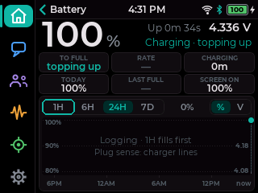 M9 · Battery | 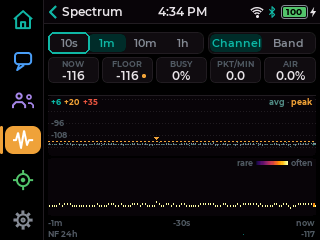 M9 · Spectrum | 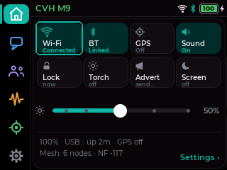 M9 · Quick panel |
| 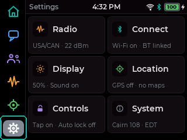 M9 · Settings |  T-Deck · Home | |

### Heltec T096

The themed one-button interface on the [T096](docs/boards/heltec-t096.md)'s 0.96" screen, rendered by the firmware's own drawing code in a desktop simulator with fictional sample data. More, including all five themes, on the [board page](docs/boards/heltec-t096.md#screens).

| | | |
|---|---|---|
| 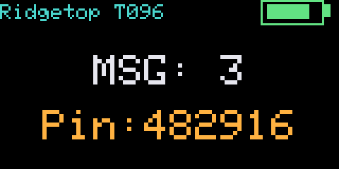 T096 · Home | 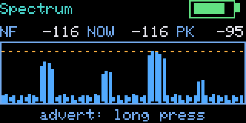 T096 · Spectrum | 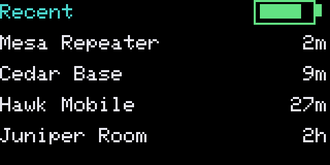 T096 · Recent |
| 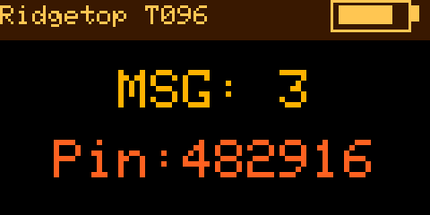 T096 · Night theme | 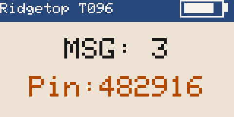 T096 · Soft theme | 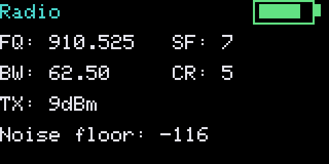 T096 · Radio |

## Reporting a problem

[Open an issue](https://github.com/cvhviz/Cairn/issues/new/choose) and pick **Bug report**. The form asks for the board, the build number from the splash screen, how you installed it, and what happened. A serial log helps a lot. Reports on 🧪 preview boards are especially useful, including "it works".

## Publishing a release (for the online updater)

The L2, Heltec V4 touch, ThinkNode M9, T-Deck and T-Display SF32 builds read `https://api.github.com/repos/cvhviz/Cairn/releases/latest`. For a build to be offered:

- Tag it `cairn-vN`, where N is the build number shown on the splash (it must be higher than the device's own). Publish it as a normal release, not a draft or prerelease.
- Attach each board's `-update.bin` under its exact name, with nothing between the date and `-update.bin`. The SF32 also accepts a `.sha256` file next to its update.
- GitHub records each file's SHA-256, which the device checks, along with the size and the board's OTA marker inside the image.
- No other asset may start with one of these board prefixes and end in `-update.bin`. Preview boards use their own board names.
- The release notes are shown on the device before installing, so keep the top of them short and plain.

| Board           | Update file                                           |
| --------------- | ----------------------------------------------------- |
| L2 Pro          | `MeshCore-WioL2Pro-CairnN-YYYY-MM-DD-update.bin`      |
| Heltec V4 touch | `MeshCore-HeltecV4Touch-CairnN-YYYY-MM-DD-update.bin` |
| ThinkNode M9    | `MeshCore-ThinkNodeM9-CairnN-YYYY-MM-DD-update.bin`   |
| T-Deck          | `MeshCore-TDeckPlus-CairnN-YYYY-MM-DD-update.bin`     |
| T-Display SF32  | `MeshCore-TDisplaySF32-CairnN-YYYY-MM-DD-update.bin`  |

## Relationship to upstream

This is a personal build, not a general-purpose distribution. All core mesh and radio behaviour comes from [MeshCore](https://github.com/meshcore-dev/MeshCore). See that project for protocol documentation, the official flasher, its own list of supported hardware and the client apps. Cairn tracks MeshCore releases; the release notes say which version each build is based on. Credit to the MeshCore developers and community for the foundation.

## License

MIT, same as upstream MeshCore. The firmware embeds third-party fonts, emoji and libraries under their own licences; see [THIRD_PARTY_NOTICES.md](THIRD_PARTY_NOTICES.md) and [licenses/](licenses/).
