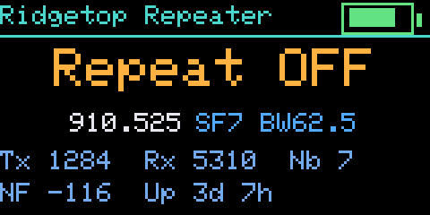
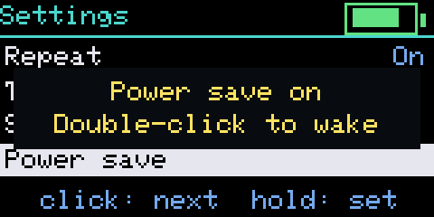
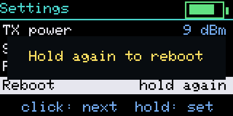

# Compact repeater

A repeater image for small one-button boards with a screen. It is the standard MeshCore repeater (the same mesh behaviour, CLI and remote admin) with a minimal Cairn screen and a power save that turns the screen and the TX LED off.

| Board | Screen | Status | File |
|---|---|---|---|
| Heltec Mesh Node T096 | 0.96" colour TFT | ✅ beta | `MeshCore-HeltecT096-CairnN-<date>-repeater.uf2` |
| Heltec T114 | 1.14" TFT | 🧪 | `MeshCore-HeltecT114-CairnN-<date>-repeater.uf2` |
| Heltec WiFi LoRa 32 V2 | 0.96" OLED | 🧪 | `MeshCore-HeltecV2-CairnN-<date>-repeater-full.bin` / `-update.bin` |
| Heltec WiFi LoRa 32 V3 | 0.96" OLED | 🧪 | `MeshCore-HeltecV3-CairnN-<date>-repeater-full.bin` / `-update.bin` |
| Heltec WiFi LoRa 32 V4 | 0.96" OLED | 🧪 | `MeshCore-HeltecV4-CairnN-<date>-repeater-full.bin` / `-update.bin` |
| Heltec V4-R8 | 0.96" OLED | 🧪 | `MeshCore-HeltecV4R8-CairnN-<date>-repeater-full.bin` / `-update.bin` |
| Heltec Wireless Tracker | 0.96" colour TFT | 🧪 | `MeshCore-HeltecTracker-CairnN-<date>-repeater-full.bin` / `-update.bin` |
| Heltec Wireless Tracker V2 | 0.96" colour TFT | 🧪 | `MeshCore-HeltecTrackerV2-CairnN-<date>-repeater-full.bin` / `-update.bin` |

✅ beta: run on hardware. 🧪: built from the same code, not yet tried on that board. Reports are welcome.

## Screens

Rendered by the firmware's own drawing code in a desktop simulator, exactly as the T096 panel draws them (shown at 3×), with fictional sample data. The other colour TFT boards look the same; the OLED boards draw it in white on black.

| | | |
|---|---|---|
| <br>Status | <br>Spectrum | <br>Settings |
| <br>Repeat off | <br>Power save notice | <br>Reboot confirm |

## Pages

One button. **Click** moves to the next page; **hold** acts.

| Page | Shows | Hold |
|---|---|---|
| **Status** | repeat on/off, the channel, packets sent and heard, neighbours, noise floor, uptime, battery | turn off (keep holding, see [Turning off](#turning-off)) |
| **Spectrum** | the channel's signal over the last ~16 seconds, with the noise floor, the latest and the peak level | send an advert |
| **Settings** | Repeat (on/off), TX power, Send advert, Power save, Reboot | change or run the selected row |

On Settings a click steps down the rows, and a click past the last row returns to Status. Reboot asks for a second hold within 5 seconds. Settings are applied through the repeater's own CLI, so they are saved exactly as `set repeat` or `set tx` would save them over serial or remote admin. TX power steps through 1, 5, 9, 13, 17 and 22 dBm of radio-chip output; boards with a front-end amplifier (T096, V4) add its gain on top.

The screen turns off after 30 seconds (2 minutes on Spectrum); the first press only wakes it.

## Power save

Hold **Power save** in Settings. The screen and the TX LED turn off, and the setting is kept across reboots and power cuts, so a deployed repeater stays dark. **Double-click** the button to wake it; single clicks and holds are ignored while it is dark.

## Turning off

Hold the button on **Status**. The screen says *Keep holding to turn off*; after about 3 seconds it says *Release to turn off*, and letting go turns the repeater off (screen, radio and LEDs). Letting go earlier cancels. Press the button to turn it back on: it boots as a normal repeater with its settings.

## Screenshots

A compact repeater built with `-D UI_SERIAL_SHOT` (a screenshot build, not the release images from Cairn 111 on) answers `shot` on its serial console with the screen as text rows; [`tools/repeater_shot.py`](../../tools/repeater_shot.py) turns that into a PNG (`--before "ui click"` steps to the next page first).

## Install

- **T096, T114 (nRF52840):** double-tap reset to get the board's USB drive, then copy the `.uf2` onto it ([UF2 guide](../install/nrf52-uf2.md)).
- **Heltec V2, V3, V4, V4-R8, Wireless Tracker (ESP32):** the `-repeater-full.bin` at `0x0` for a first install, or the `-repeater-update.bin` at `0x10000` to update ([ESP32 guide](../install/esp32-s3.md)).

A board that already ran a MeshCore repeater keeps its name, radio settings and password. A board coming from a companion image starts as a new repeater with the default admin password `password`: change it with `password <new>` over serial or remote admin.

## Example setup (US)

A new repeater starts on the European default channel (869.618 MHz). Over USB serial (115200 baud, any serial terminal or the MeshCore web flasher's console), set it up for the US 915 MHz band like this, with your own name, password and location:

```
set name Ridgetop Repeater
set radio 910.525,62.5,7,5
set tx 9
password MyAdminPass
set lat 35.1234
set lon -97.5678
reboot
```

- `set radio` is frequency (MHz), bandwidth (kHz), spreading factor and coding rate: `910.525,62.5,7,5` is the common US/Canada MeshCore channel. Use whatever your local mesh uses; every node must match.
- `set tx` is the radio chip's output in dBm (on the T096 and Heltec V4, ~13 dB of amplifier gain comes on top). Keep the result within your local limits.
- `reboot` applies the radio change. After it, `advert` (or **Send advert** on the screen) announces the repeater to the mesh.
- Optional: `set flood.advert.interval 12` announces it across the whole mesh every 12 hours (3–168), `set advert.interval 240` to its direct neighbours every 4 hours (minutes, up to 240), and `set repeat off` makes it listen without relaying.
