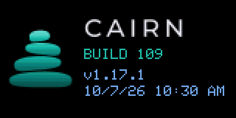
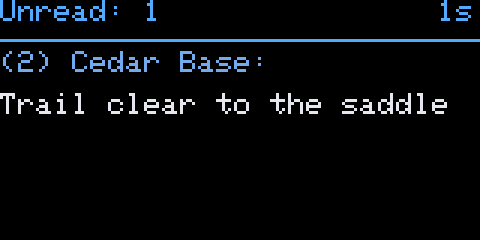
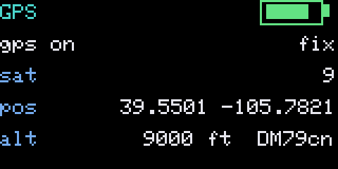
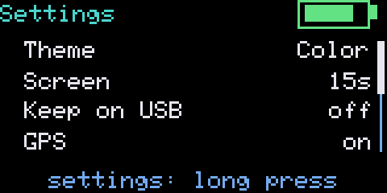
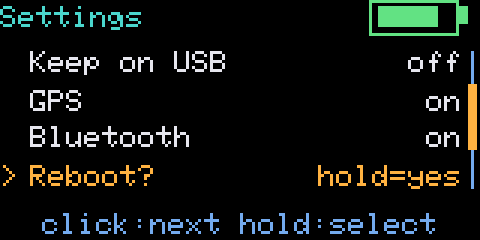
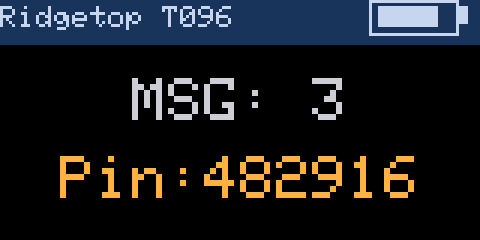
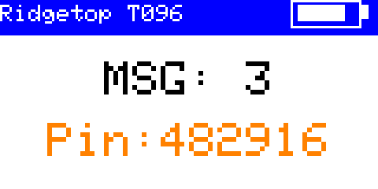

# Heltec Mesh Node T096

✅ Tested on hardware · nRF52840 · [install with UF2](../install/nrf52-uf2.md)

nRF52840, SX1262 LoRa, 0.96" 160×80 ST7735 colour TFT, one button and GPS. Cairn runs a themed one-button interface on it ([screens](#screens)). For a repeater on this board, see [Compact repeater](compact-repeater.md).

## Which file

| You want… | File |
|---|---|
| the companion over Bluetooth (phone app): **the main build** | `MeshCore-HeltecT096-CairnN-<date>-ble.uf2` |
| the companion over USB serial (no Bluetooth, no GPS page) | `MeshCore-HeltecT096-CairnN-<date>-usb.uf2` |

Install, update and recovery all use the same file: double-tap **RST** and copy the `.uf2` onto the drive that appears ([details](../install/nrf52-uf2.md)). Updating keeps your identity, contacts, channels and settings, including the theme.

## Buttons

| Button | Does |
|---|---|
| the button, short press | next page |
| the button, hold | the page's action (for example, send an advert on the Spectrum page); Reboot and Hibernate arm on the first hold and act on a second |
| the button, hold during the first 8 s after boot | open the rescue console |
| RST | restart; **double-tap** for the UF2 drive |

## Features

- Themes: Dark, Color, Night, Soft and Stock (Settings > Theme).
- Spectrum page with a scrolling RSSI history and NF / NOW / PK readouts.
- Radio page: the frequency in MHz with the TX power, SF / BW / CR in the theme's accent, and the noise floor (from Cairn 111).
- GPS page: fix, satellites and HDOP, position, altitude and the Maidenhead grid square (from Cairn 111).
- Settings: Theme, Screen, Keep on USB, GPS, Bluetooth, Reboot, Hibernate.
- Cairn splash in your theme's colours, with the build number.
- Feet and °F, 12-hour clock.

## Screens

The companion build with the default Color theme. These were rendered by the firmware's own drawing code in a desktop simulator, exactly as the panel draws them (shown at 3×), with fictional sample data.

| | | |
|---|---|---|
|  Splash |  Home |  Message |
|  Recent |  Spectrum |  Radio |
|  GPS |  Settings |  Settings · Reboot armed |

### Themes

| | | |
|---|---|---|
|  Color (default) |  Dark |  Night |
|  Soft |  Stock | |

## Known issues

- The USB build has no Bluetooth and no GPS page by design.
- Check each build's release notes for anything new.

Problems? [Report a bug](https://github.com/cvhviz/Cairn/issues/new?template=bug_report.yml).
