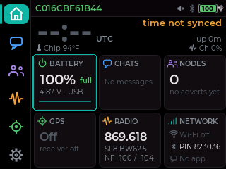

# LilyGO T-Deck / T-Deck Plus

✅ Tested on hardware, beta · ESP32-S3 · [install with esptool or the web flasher](../install/esp32-s3.md) · updates over Wi-Fi (from Cairn 108 on)

The T-Deck is a handheld with:
- an ESP32-S3 (16 MB flash, 8 MB PSRAM)
- a Semtech SX1262 LoRa radio
- a 2.8" 320×240 ST7789 touchscreen (GT911 touch)
- a QWERTY keyboard (its own ESP32-C3 controller) and a trackball with a centre click
- a microSD slot, a speaker (message chimes and tones, with a volume setting, from Cairn 109), and on the T-Deck Plus a GPS and a larger battery
- native USB on its USB-C port (no USB-serial chip)

Cairn runs the same interface as the [Wio Tracker L2 Pro](wio-tracker-l2-pro.md) on it, by touch or by keys. The trackball moves a ring over what is selected and its click taps it, as a finger would; touching the screen hides the ring. Typing goes straight into chats and text fields. The keyboard has no Back key: Backspace outside a text field goes back, and so does holding the trackball in when nothing is selected. The [L2 manual](../Cairn_Wio_L2_Pro_User_Manual.pdf) describes the screens.

**Beta** means it is tested on hardware but new to Cairn. On a T-Deck it has run with the screen, touch, keyboard, trackball, LoRa radio, an offline map from microSD, and an identity and contacts carried over from another firmware. Cairn's full automated on-device test suite hasn't been run on it yet, and some features are untried; see [Known issues](#known-issues).

## Keyboard

- **Keyboard light:** lit while the screen is on, dark when it goes dark or locks. Set its level, or Off, in Settings › Hardware › Display (under Brightness) or with the keyboard slider in the quick panel. Alt+B still turns it on or off, until the screen next wakes or goes dark.
- **Space is the customizable button:** outside a text field, Space and double Space run the actions picked in Settings › Hardware › Buttons (Quick panel and New message by default). A single Space acts after a short wait for a second one, unless double Space is set to None. On a dark screen Space only wakes it, and locked it does nothing.
- **Charging:** the blue LED is the charge light (on while charging, off when full); the T-Deck charges from USB-C with the power switch on or off. On USB the cell can't be read (the battery pin sees USB power), so the status bar, Home and the Battery page say "USB · charging" instead of a percent (from Cairn 111); the blue LED going out is the sign it's charged.
- **GPS (T-Deck Plus, or an add-on GPS):** found at 9600 or 38400 baud by itself; a u-blox receiver goes to standby while GPS is off (from Cairn 111).
- **Battery saver** (Settings › Hardware › Display › Power, off by default, beta, from Cairn 111): while the screen is dark the chip sleeps between radio packets, with Bluetooth off. Its savings haven't been measured yet.

## Screens

Home on a T-Deck running Cairn 108, with the trackball's focus ring on the Battery card. The other pages look as on the [L2 Pro](wio-tracker-l2-pro.md) and the [ThinkNode M9](thinknode-m9.md#screens).

## Which file

| You want to… | File | How |
|---|---|---|
| install Cairn for the first time | `MeshCore-TDeckPlus-CairnN-<date>-full.bin` | write at `0x0` ([steps](../install/esp32-s3.md)). If it runs MeshCore, export your key and contacts in the app first. |
| update | `MeshCore-TDeckPlus-CairnN-<date>-update.bin` | USB at `0x10000`, or over Wi-Fi: Settings > System > Firmware update fetches it from the latest release (from Cairn 108 on) |
| recover a device that won't boot | `MeshCore-TDeckPlus-CairnN-<date>-full.bin` | write at `0x0` |

The same files run on the T-Deck and the T-Deck Plus. Write the `-full.bin` or the `-update.bin`, never both.

**Download mode.** esptool and the web flasher can usually restart the T-Deck into download mode over USB by themselves. If they can't connect, switch the T-Deck off, hold the trackball in (it is the BOOT button), switch it on, then release it and connect again.

**Coming from another firmware.** Cairn keeps its identity, contacts and settings in the T-Deck's internal flash. Firmwares that keep them on the microSD card (Wadamesh does, in a `meshcomod` folder) don't carry over by themselves: Cairn starts with a new identity. Your files stay on the card. Cairn reads offline maps from the card's `cairn/maps` folder; [tools/maptiles.py](../../tools/maptiles.py) makes them.

## Known issues

- **GPS (T-Deck Plus) hasn't been checked on hardware yet.**
- **Battery percentage and battery life** haven't been measured on the T-Deck yet.
- **Hibernate:** waking with the trackball click hasn't been confirmed.
- **The full automated on-device test suite** hasn't been run on it yet. Please [report](https://github.com/cvhviz/Cairn/issues/new?template=bug_report.yml) anything that looks wrong.
