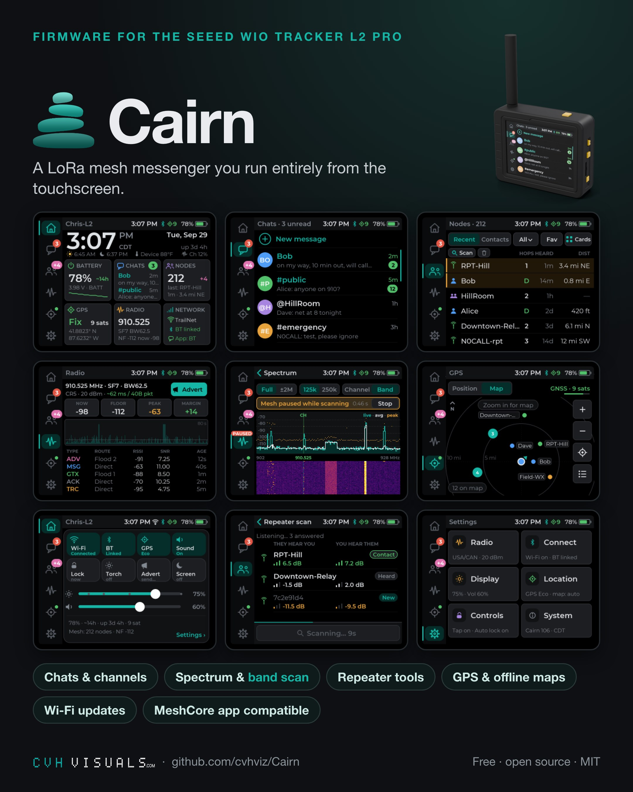

# Seeed Wio Tracker L2 Pro

✅ Tested on hardware · ESP32-S3 · [install with esptool or the web flasher](../install/esp32-s3.md) · updates over Wi-Fi

Wio-S3 module (ESP32-S3, 16 MB flash, 8 MB PSRAM), SX1262 LoRa (TCXO 3.0 V), 3.2" 320×240 NV3031B LCD with GT911 touch, L76K GPS, ES8311 speaker and microSD.

- [Brochure (PDF)](../Cairn_Wio_L2_Pro_Brochure.pdf) · [User manual (PDF)](../Cairn_Wio_L2_Pro_User_Manual.pdf) · [Screens](../../README.md#screens)
- Offline-map tool: [tools/l2_maptiles.py](../../tools/l2_maptiles.py) ([guide](../../tools/L2_MAPTILES.md))

## Which file

| You want to… | File | How |
|---|---|---|
| install Cairn for the first time | `MeshCore-WioL2Pro-CairnN-<date>-full.bin` | full erase, then write at `0x0`. **Erases everything**: export your key and contacts in the app first. |
| update | `MeshCore-WioL2Pro-CairnN-<date>-update.bin` | online (Settings > System > Firmware update), a browser upload in update mode, or USB at `0x10000` |
| recover a device that won't boot | `MeshCore-WioL2Pro-CairnN-<date>-full.bin` | full erase, then write at `0x0` |

Write the `-full.bin` or the `-update.bin`, never both. If the device last updated over Wi-Fi, run `esptool --chip esp32s3 erase-region 0xe000 0x2000` before a USB write of the `-update.bin` ([why](../install/esp32-s3.md#if-the-device-last-updated-over-wi-fi)).

## Buttons

| Button | Does |
|---|---|
| WAKE (side) | click: turn the screen off, or wake it; double-press: unlock; hold: lock |
| User (also the Boot button, GPIO0) | click: quick panel; double-press: new message (unlocks instead when the device is locked); hold: back; triple-press: mute. The first press on a dark screen only wakes it. It is the button that wakes the board from hibernate. Click, double and hold can be reassigned in Settings. |
| User + Reset | hold **User (Boot)**, tap **Reset**, release: download mode for esptool |
| Reset | restart |

## Features

- **Side icon rail**: Home, Chats, Nodes, Radio, GPS and Settings, with unread and new-advert badges. A status bar shows the page title, a 12-hour clock, Bluetooth, GPS and battery.
- **Home dashboard**: a large clock with sunrise/sunset, temperature and channel-busy readouts, plus live cards for battery, chats, nodes, GPS, radio and network.
- **Chats**: channels, direct messages and rooms in one list, message bubbles, a full on-screen keyboard with emoji, quick replies and a byte counter.
- **Colour emoji**: 229 Noto emoji drawn inline in messages, previews and node names.
- **Nodes**: recent adverts and saved contacts as a list or cards, with hops, last heard and distance. Node detail shows position and bearing, with ping, chat and map.
- **Repeater tools**: a repeater scan (who hears you, whom you hear) and remote admin for repeaters and room servers.
- **Radio**: frequency and settings, airtime per packet, Now/Floor/Peak/Margin meters, a live spectrum and the last packets heard.
- **Spectrum and band scan**: your channel over 10 s to 1 h, and a sweep of the whole band with a waterfall.
- **Quick panel**: Wi-Fi, Bluetooth, GPS and sound toggles, lock, flashlight, advert, brightness and volume.
- **GPS**: position in ft/mph with a course compass, Off / On / Eco modes, and an **offline map** from microSD tiles with pinch to zoom.
- **Settings**: every change is a draft with Cancel and Save; destructive actions need a hold plus a confirmation.
- **Sound**: volume and a choice of alert tone per event.
- **Wake & lock**: tap to wake, auto-lock, and a pocket-safe lock screen.
- **Wi-Fi**: on-device setup, clock sync, the MeshCore app over Wi-Fi, browser updates, and **online updates** from this repository's releases (checked once a day; nothing installs without your confirmation).

## Known issues

- Battery figures with the screen off are estimates; they haven't been measured yet.
- The offline map needs a **FAT32** card (8–32 GB SDHC recommended). exFAT cards aren't read.
- Check each build's release notes for anything new.

Problems? [Report a bug](https://github.com/cvhviz/Cairn/issues/new?template=bug_report.yml).
